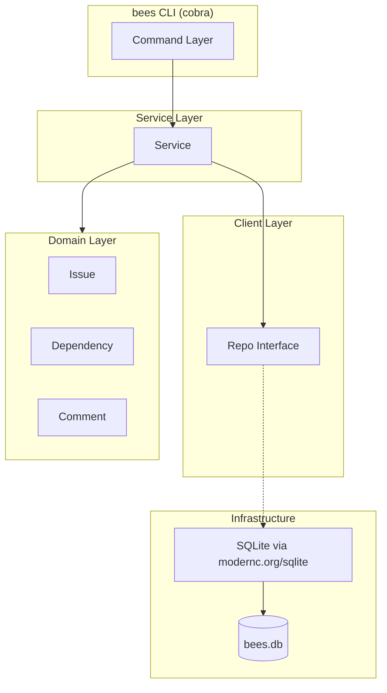
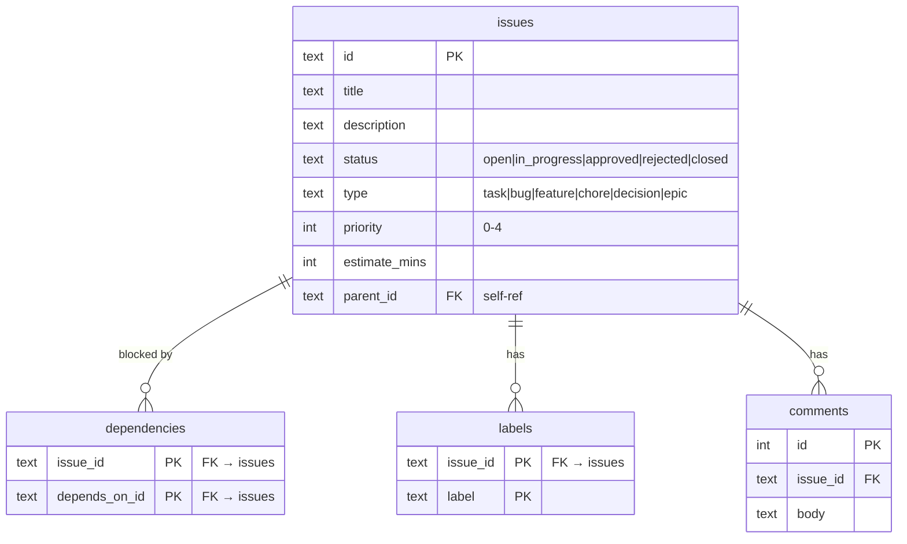

# bees

<div align="center">
  
</div>

## Problem

[Beads](https://github.com/steveyegge/beads) is a powerful alternative to a collection of .md files that grew to serve multi-agent orchestration. For a developer that likes to keep their hands on the wheel while pairing with an agentic navigator, ~80% of it is dead weight.

## Solution

Bees follows Beads as an alternative to a sea of .md files and drops everything else.

## Architecture

### Flow Chart



### ER Diagram



## Usage

```text
bees init [--stealth] [--prefix]      bees ready [--sort --limit]
bees create "title" [flags]           bees upcoming [--days --assignee]
bees show <id>                        bees search <query>
bees update <id> [flags]              bees dep add <id> --blocks <id>
bees close <id>                       bees dep remove <id> <id>
bees reopen <id>                      bees comment <id> "text"
bees delete <id>                      bees stale [--days]
bees list [--status --type ...]       bees config set|get|list
bees export [-o file.jsonl]           bees version
bees import <file.jsonl>
```